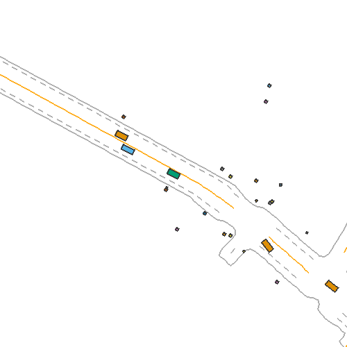
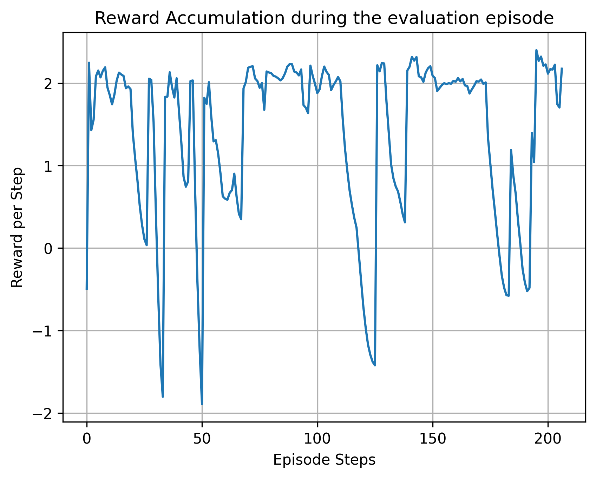
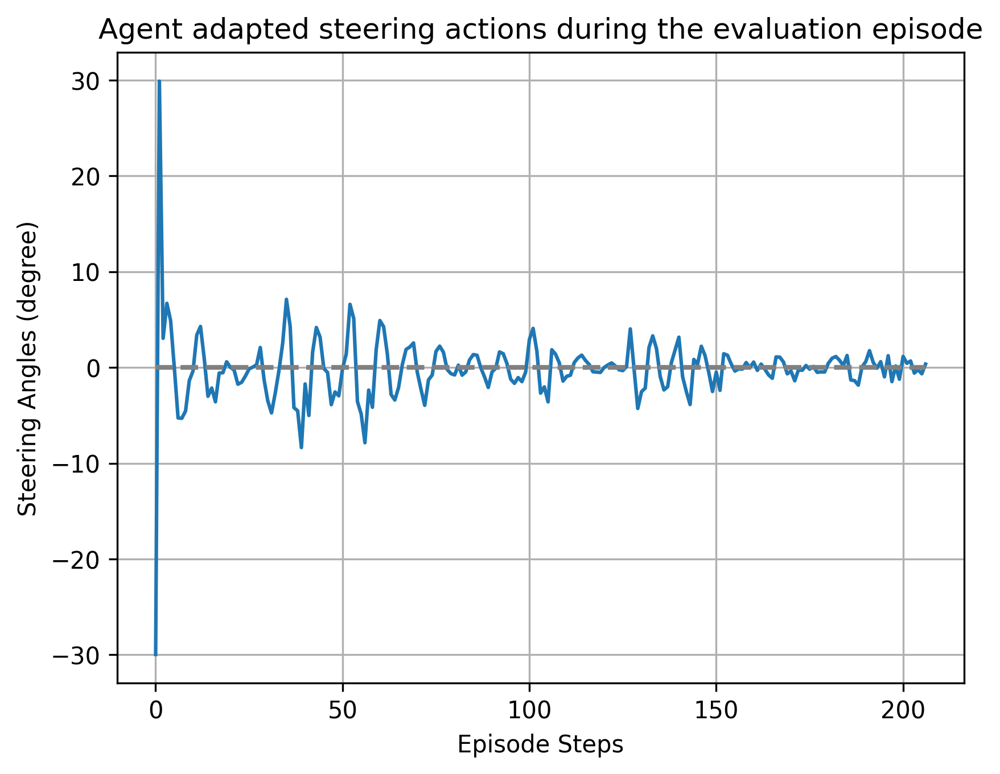
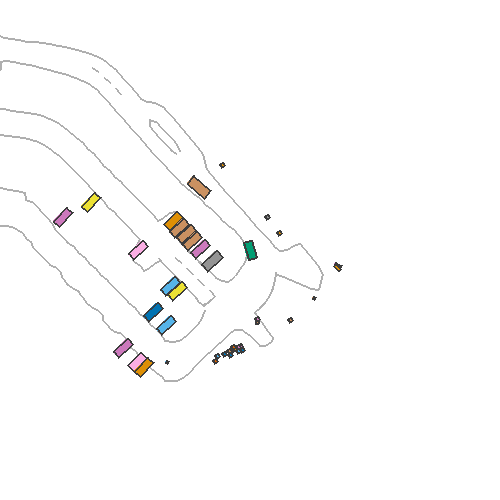
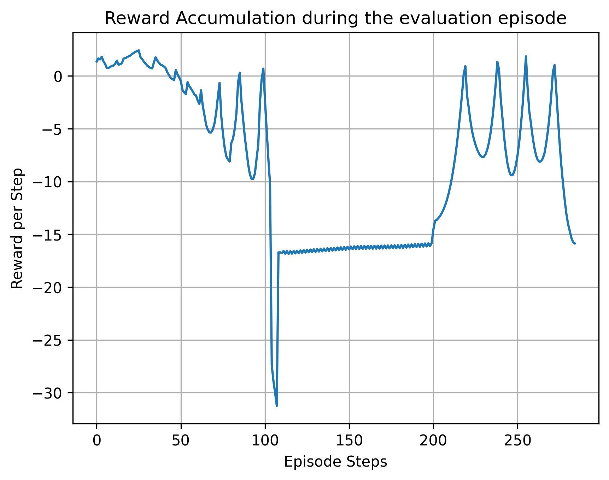
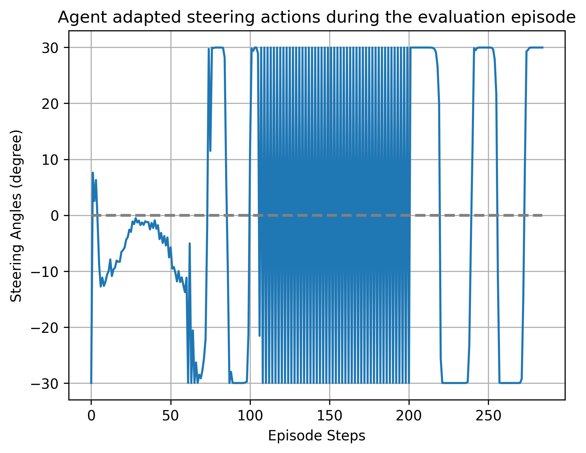
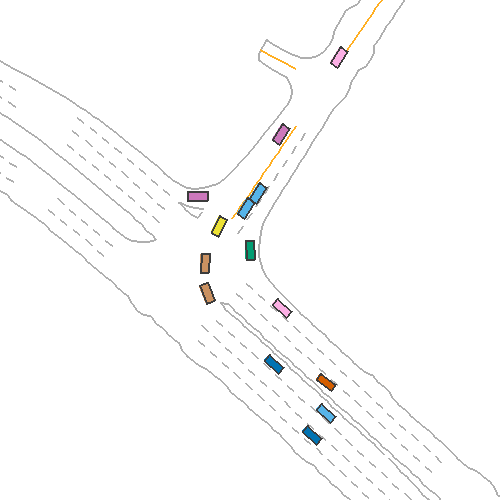
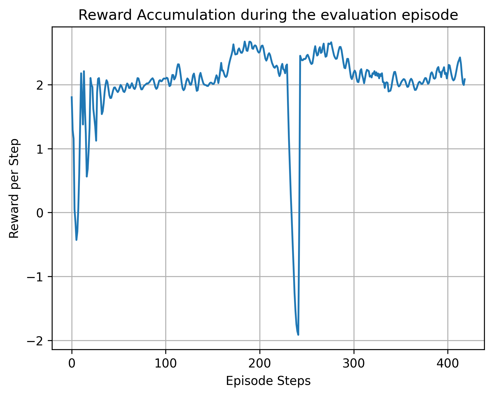
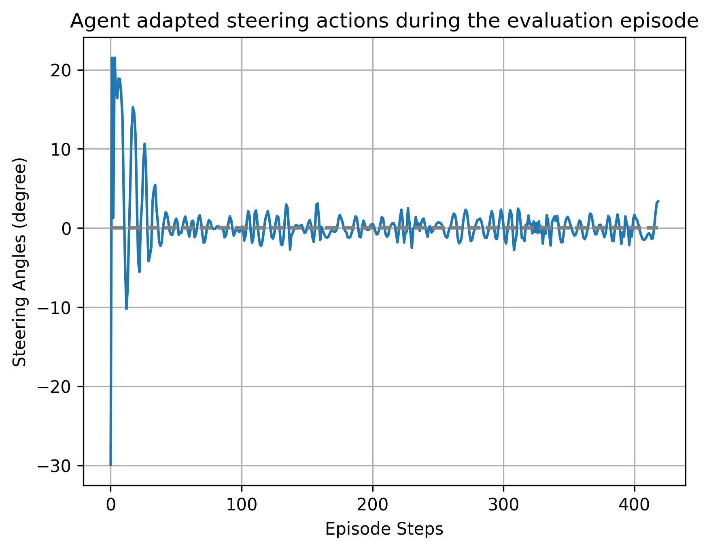

**TD3 - Twin Delayed Deep Deterministic Policy Gradient**

**Overview**

This folder contains the training and evaluation scripts for a TD3 agent trained to control an autonomous vehicle in the ScenarioNet simulation environment, using real-world NuScenes traffic scenarios.

**Work Process**

The development went through many iterations. The agent started with poor driving behavior, struggling to maintain lane position and build up speed. From there, the reward function was redesigned multiple times and hyperparameters were tuned to progressively improve behavior. Key reward design decisions included penalizing lateral deviation from the lane center, encouraging smooth steering, rewarding velocity buildup, and dynamically handling safe following distance based on the vehicle's current speed.

The agent was trained on 10 ScenarioNet scenes and evaluated on scenes 0, 1, 3, 6, 7, and 8.

**Scripts**

- `MA_td3_driveforward_v50_scratch_fix_seed_v1_v1.py` - Earlier version with a 5-element observation space (velocity, steering, acceleration, lateral distance, front distance)
- `MA_td3_driveforward_v50_ogscript_change_v7.py` - Improved version with an 8-element observation space, adding navigation signals (forward, left, right) to help the agent make better directional decisions

**Results - Selected Scenes**

Results are shown for three scenes with varying road geometries, including straight segments, right turns, and left turns, to demonstrate how the agent handles different driving conditions.

Scene 1

Scene 6

Scene 7

**Status**

Work in progress. 

